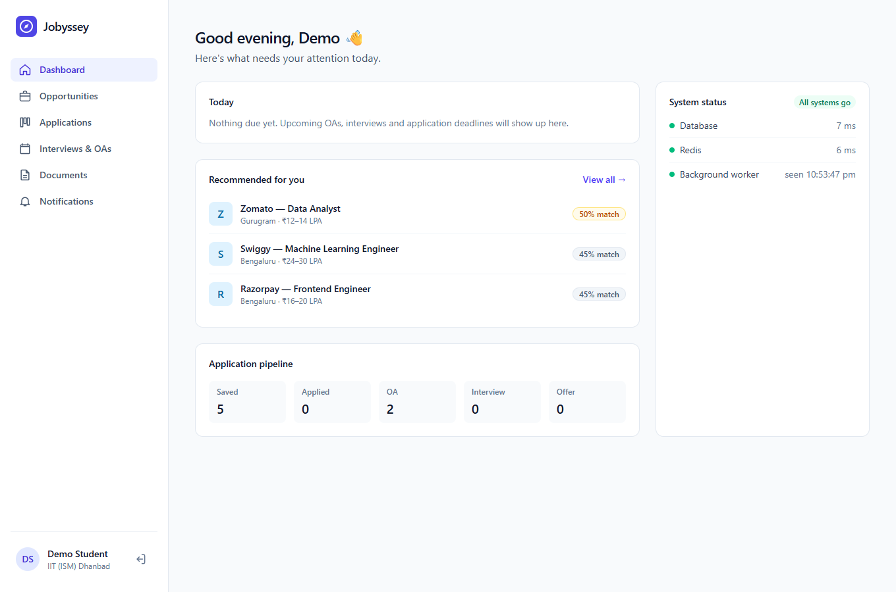
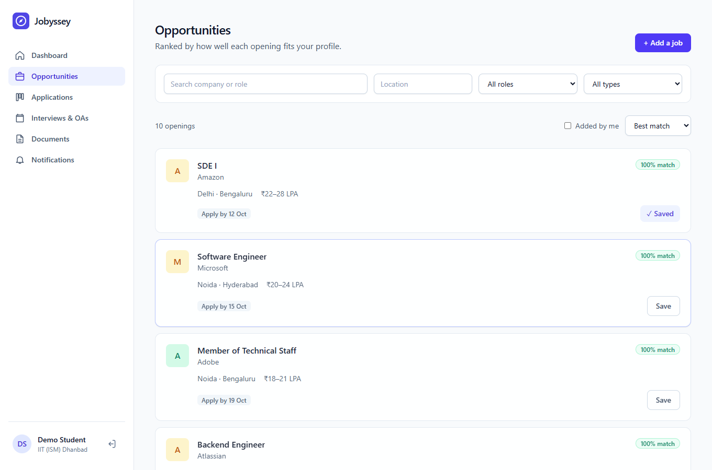
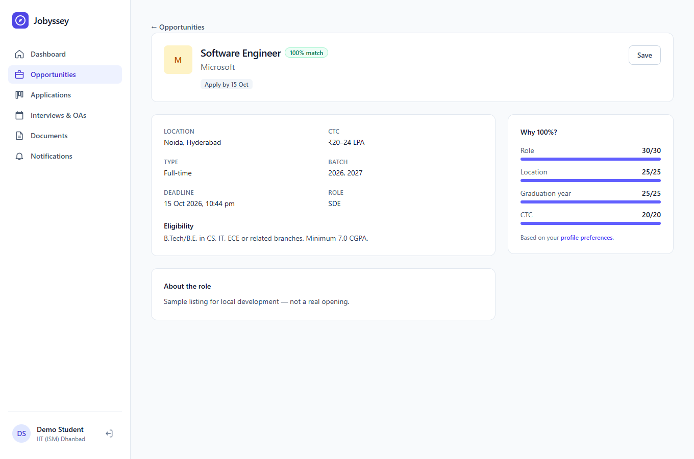
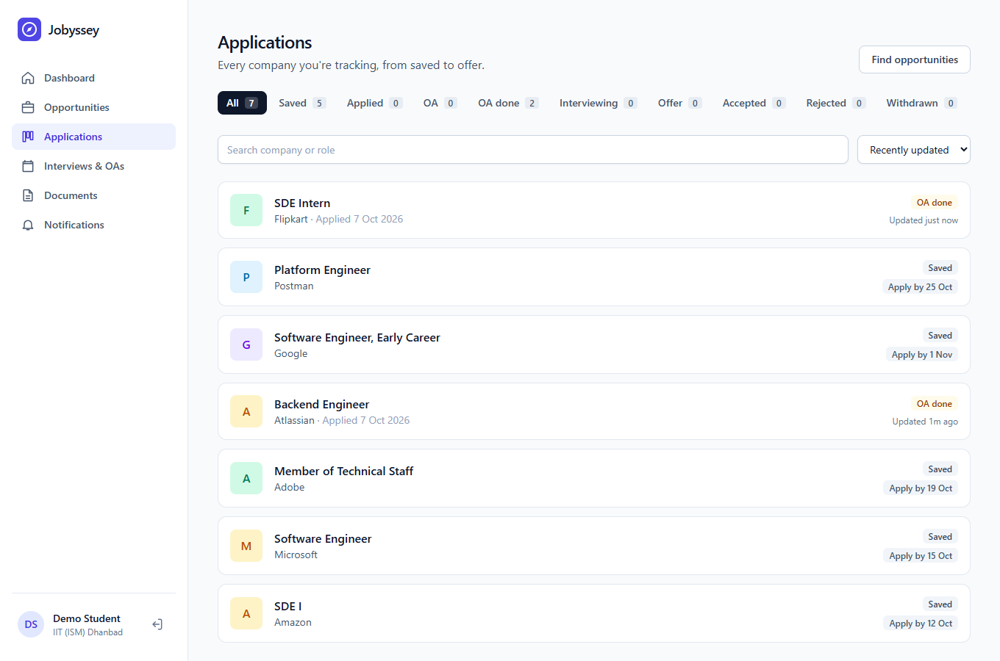
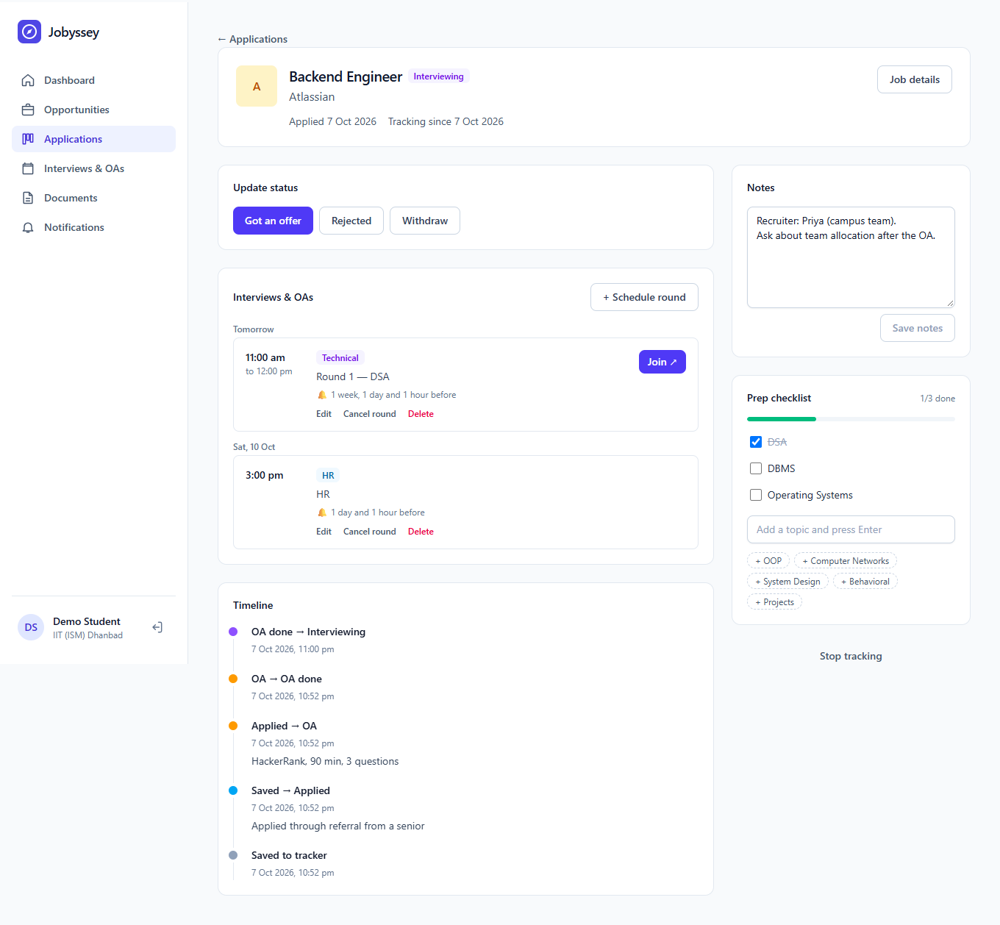
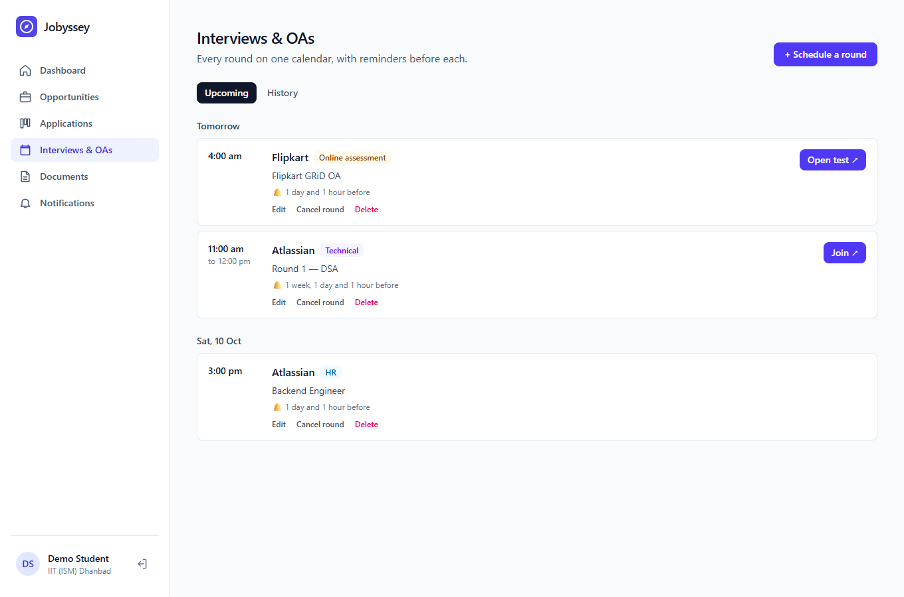
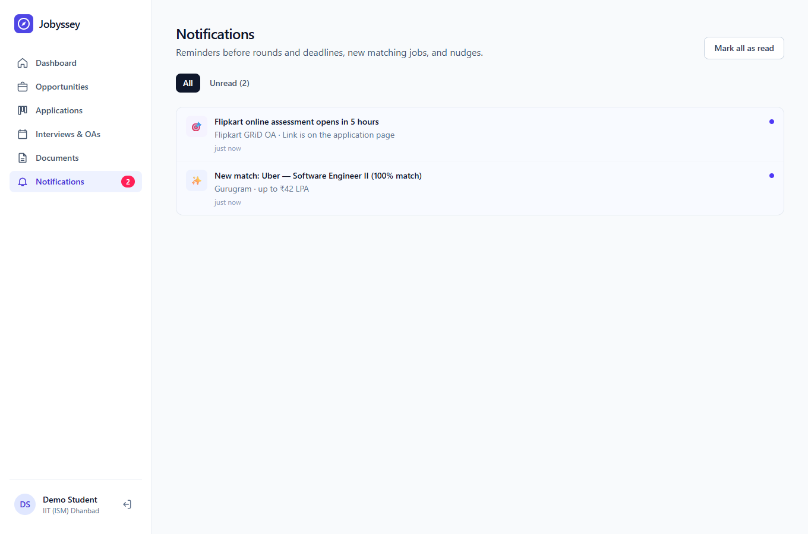
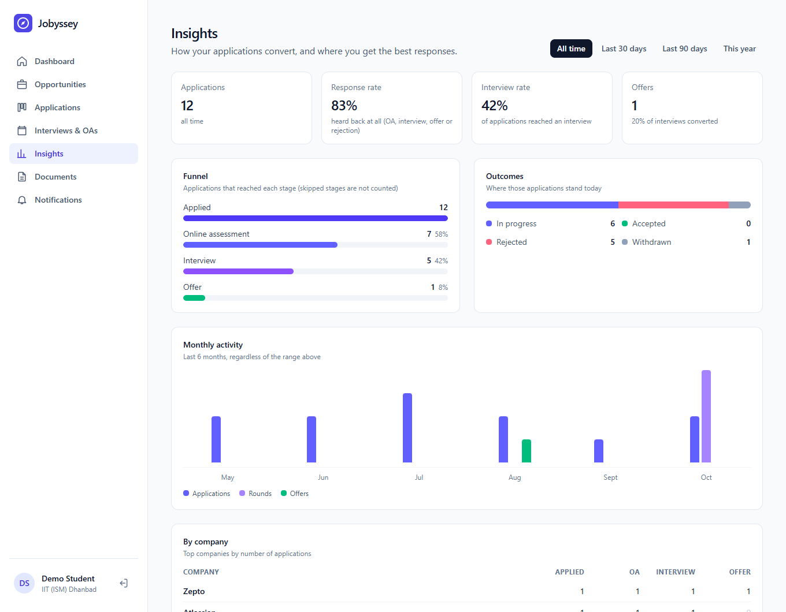
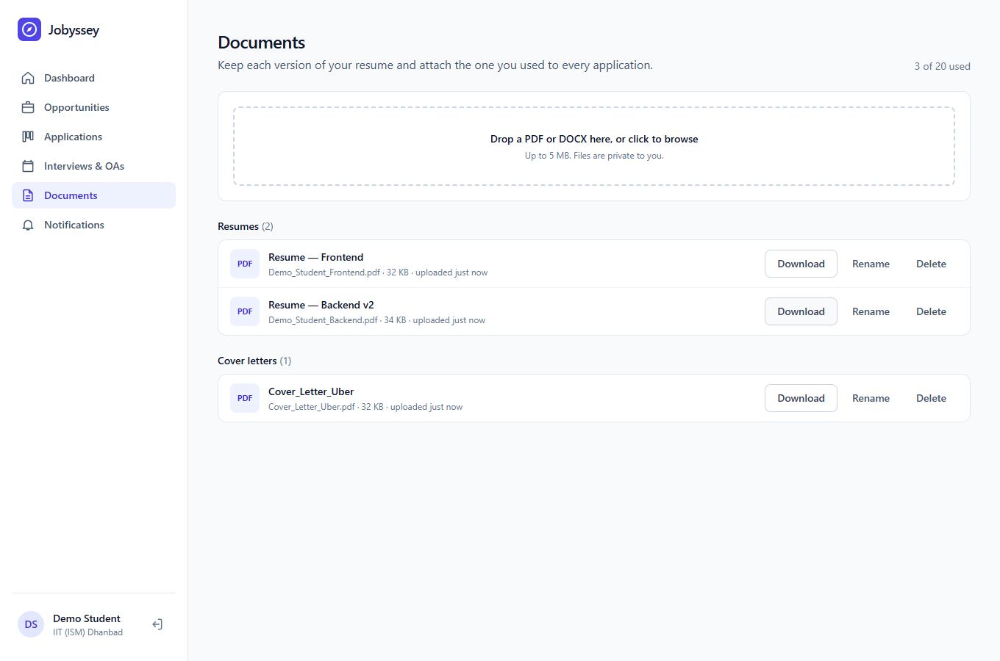
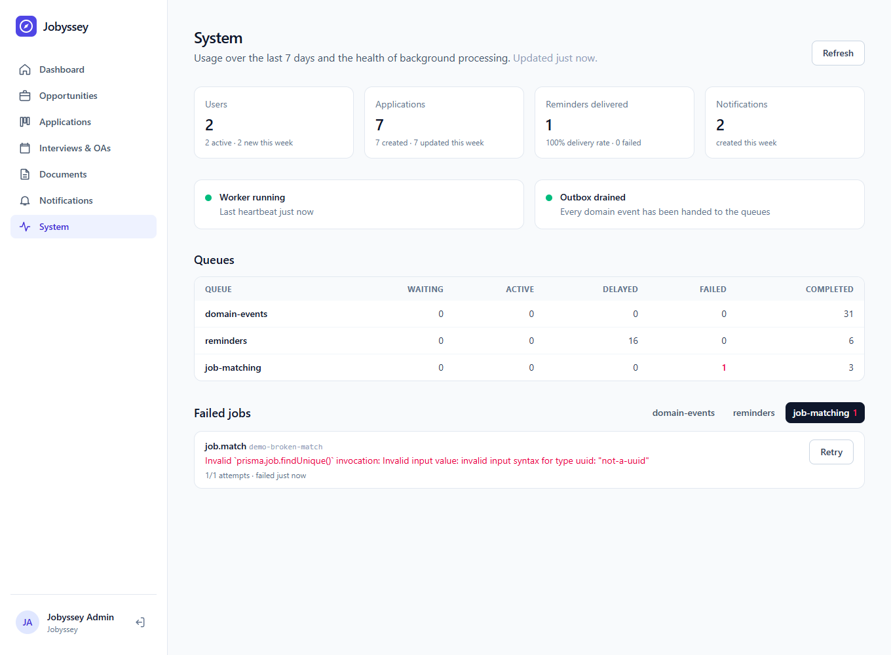

# Jobyssey

**Your personal placement operating system.** Discover opportunities, track
applications, manage deadlines and interviews, and never miss a placement event.

`React · Node.js · Express · PostgreSQL · Redis · BullMQ · Docker`



| Opportunities | Job detail |
|---|---|
|  |  |
| **Applications** | **Application detail** |
|  |  |
| **Interviews & OAs** | **Notifications** |
|  |  |
| **Insights** | **Documents** |
|  |  |
| **System (admin)** | |
|  | |

---

## Status

| Phase | Scope                                   | State        |
|-------|-----------------------------------------|--------------|
| 0     | Design: architecture, schema, API       | ✅ Done      |
| 1     | Foundation: API, worker, DB, Docker, UI shell | ✅ Done |
| 2     | Authentication: signup, login, rotating refresh tokens, rate limits, profile | ✅ Done |
| 3     | Jobs: listings, private jobs, match scoring, search/filters, save, caching | ✅ Done |
| 4     | Applications: tracker, status transitions, timeline, notes, prep checklist | ✅ Done |
| 5     | Interviews & OAs: rounds, meeting links, reminder schedule, agenda | ✅ Done |
| 6     | Workers: outbox relay, BullMQ reminders, notifications, job matching, stale nudges | ✅ Done |
| 7     | Reliability: idempotency keys, client retries, failed-job admin, data retention | ✅ Done |
| 8     | Documents: direct-to-storage uploads, resume versions, resume per application | ✅ Done |
| 9     | Analytics: funnel, response/interview rates, monthly activity, cached dashboard | ✅ Done |
| 10    | Testing & load testing: 187 backend + 14 frontend tests, 95% coverage, API and worker load tests | ✅ Done |

Design docs:

- [`docs/architecture.md`](docs/architecture.md) — system design, state machine, outbox, queues, deployment
- [`docs/schema.md`](docs/schema.md) — every table and why it looks the way it does
- [`docs/api.md`](docs/api.md) — REST contract, error codes, idempotency, pagination
- [`docs/performance.md`](docs/performance.md) — test suites, coverage, load-test results, bottlenecks

---

## Repository layout

```text
backend/              Express API + background worker (one image, two entrypoints)
  prisma/             schema.prisma + migrations
  src/
    config/           env validation (zod), logger, redis
    controllers/      request → service → response
    domain/           pure business rules (state machine, job match scoring)
    middleware/       request id, errors, auth, rate limits, idempotency keys
    models/           Prisma client
    queues/           BullMQ queue definitions
    routes/           HTTP wiring
    services/         business logic
    storage/          document storage drivers (Supabase Storage, local disk)
    workers/          outbox relay, event handlers, reminders, job matching, sweeps, pruning
    server.js         API entrypoint
    worker.js         worker entrypoint
  tests/              Jest + Supertest
frontend/             Vite + React + Tailwind SPA
docs/                 design documents
docker-compose.yml    postgres, redis, migrate, api, worker
```

---

## Running locally

Prerequisites: Node 22+, Docker.

### Option A — everything in Docker

```bash
docker compose up -d --build        # postgres, redis, migrations, api, worker
cd frontend && npm install && npm run dev
```

Open <http://localhost:5173>. The API is on <http://localhost:4001>.

### Option B — API and worker on your machine (hot reload)

```bash
docker compose up -d postgres redis

cd backend
cp .env.example .env
npm install                         # also runs `prisma generate`
npm run db:deploy                   # apply migrations
npm run dev                         # API on :4001
npm run dev:worker                  # in a second terminal

cd ../frontend
npm install
npm run dev                         # http://localhost:5173
```

### Ports

Host ports are offset from the defaults so Jobyssey can run next to other local
stacks. Override them in a root `.env` (see `.env.example`).

| Service  | Host port |
|----------|-----------|
| API      | 4001      |
| Postgres | 5432      |
| Redis    | 6380      |
| Frontend | 5173      |

---

## Useful commands

```bash
# backend/
npm test               # unit + integration tests (needs `docker compose up -d postgres redis`)
npm run test:coverage  # same, with a coverage report in backend/coverage/
npm run load:api       # HTTP load test against the Docker stack (see docs/performance.md)
npm run load:worker    # outbox + reminder pipeline throughput
npm run db:migrate     # create a migration after editing schema.prisma
npm run db:studio      # browse the database
npm run user:set-role -- you@example.com ADMIN   # promote an account (admins curate public jobs)
npm run db:seed:dev    # local only: admin@jobyssey.dev + 10 sample public jobs

# health
curl localhost:4001/api/health          # liveness
curl localhost:4001/api/health/ready    # database, redis, worker heartbeat

# frontend/
npm test               # Vitest: formatting + API client (auth refresh, idempotent retries)
```

Integration tests run against a separate `jobyssey_test` database (created and
migrated automatically) and Redis DB 15, so they never touch your dev data.

---

## Deployment (beta)

Frontend on Cloudflare Pages, API on Render, Postgres + file storage on Supabase,
Redis on Upstash. See [architecture §9](docs/architecture.md#9-deployment-beta-0)
for the free-tier caveats (sleeping instances, cross-site cookies, connection
limits) and how the design handles them.
